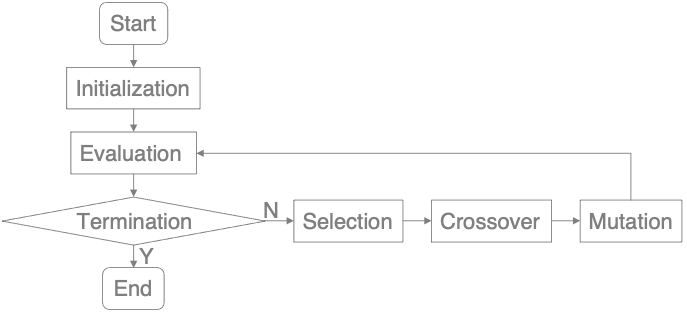
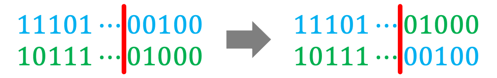

# GA_Knapsack_problem

## knapsack problem

##### The knapsack problem is a problem in combinatorial optimization: Given a set of items, each with a weight and a value, determine the number of each item included in a collection so that the total weight is less than or equal to a given limit and the total value is as large as possible.

### Problem Definition

* Given
  * There are ten for each item
  * The maximum capacity of the knapsack is 275
  * | Item    | A   | B   | C   | D   | E   | F   | G   | H   | I   | J   |
    | :-----: |:---:|:---:|:---:|:---:|:---:|:---:|:---:|:---:|:---:|:---:|
    | Weight  | 1   | 2   | 3   | 4   | 5   | 6   | 7   | 8   | 9   | 10  |
    | Value   | 6   | 7   | 8   | 9   | 10  | 11  | 12  | 13  | 14  | 15  |

* Find
  * a set of items

* Best known solution
  * Overall weight equal to 275
  * Overall value (fitness) equal to 620
  * | Item    | A   | B   | C   | D   | E   | F   | G   | H   | I   | J   |
    | :-----: |:---:|:---:|:---:|:---:|:---:|:---:|:---:|:---:|:---:|:---:|
    | #       | 10  | 10  | 10  | 10  | 10  | 10  | 8   | 0   | 1   | 0   |

---

## Program

* main.cpp

### Argument

* ROUND: number of round
* GENERATION: number of generation
* POPULATION: number of population
* CROSSOVER_RATE: probability of crossover
* MUTATION_RATE: probability of mutation
* MUTATE_POINT: number of the mutate point

### Result

 * output.txt

### Encoding
```
/* Each individual has the following data */
int gene[100];   // Each bit is either zero or one
int weight;
int fitness;
```
| Item   | A     | B     | C     | D     | E     | F     | G     | H     | I     | J     |
| :----: |:-----:|:-----:|:-----:|:-----:|:-----:|:-----:|:-----:|:-----:|:-----:|:-----:|
| Index  | 0~9   | 10~19 | 20~29 | 30~39 | 40~49 | 50~59 | 60~69 | 70~79 | 80~89 | 90~99 |

---

## Genetic Algorithm (GA)

##### In computer science and operations research, a genetic algorithm (GA) is a metaheuristic inspired by the process of natural selection that belongs to the larger class of evolutionary algorithms (EA). Genetic algorithms are commonly used to generate high-quality solutions to optimization and search problems by relying on biologically inspired operators such as mutation, crossover and selection.

### FlowChart



#### Initialization

```
/* For each individual */
for (int i = 0; i < 100; i++) {
    gene[i] = random(0 or 1);
}
int weight = 0;
int fitness = 0;
```

#### Evaluation

```
If it is not overweight:  
    fitness = #_item * value_item;

If it is overweight, change the bit with the largest index and value 1 to 0：  
    fitness = #_item * value_item - #_takeAway_item * value_takeAway_item;
```

#### Selection (Tournament Selection)

Step description:  
step 1) Randomly select two individuals from the population for comparison, and put the one with higher fitness into the mating pool.  
step 2) Repeat step 1 until the number of mating pools equals the population.

#### Crossover (Single-Point Crossover)

Pick two individuals randomly from the mating pool, and then randomly generate a crossover point (the red line) ∈ [1, 99].
Starting from the crossover point (the red line), cross the two gene sequences. As shown below:



#### Mutation

* Single-Point Mutation: Every individual has a chance of mutation, but only a random bit will mutate  


* Multiple-Point Mutation: Every individual has a chance of mutation, and every bit has a chance of mutation  

